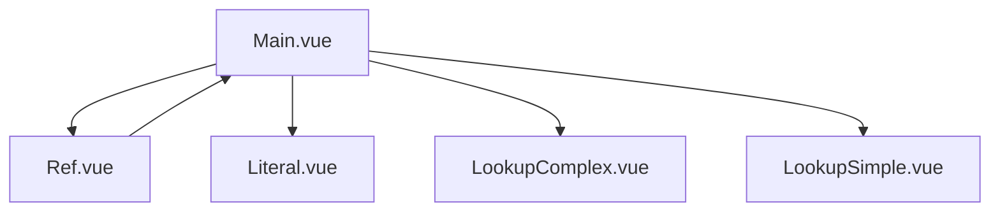

```mermaid
graph TD
    A[Main.vue] -->B[Ref.vue];
    B[Ref.vue]  -->A[Main.vue];
    A[Main.vue] -->C[Literal.vue];
    A[Main.vue] -->D[LookupComplex.vue];
    A[Main.vue] -->E[LookupSimple.vue];
```

Main.vue in the main component for fields, it then kicks it off to the Ref.vue if the component is recursive, ultimately all fields are Literal or Lookups